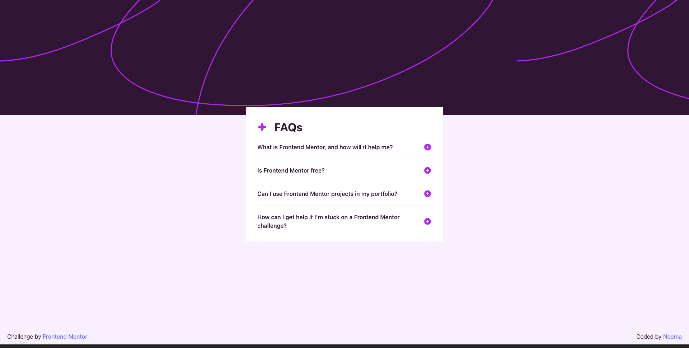

# Frontend Mentor - FAQ accordion solution

This is a solution to
the [FAQ accordion challenge on Frontend Mentor](https://www.frontendmentor.io/challenges/faq-accordion-wyfFdeBwBz).
Frontend Mentor challenges help you improve your coding skills by building realistic projects.

## Table of contents

- [Overview](#overview)
    - [The challenge](#the-challenge)
    - [Screenshot](#screenshot)
    - [Links](#links)
- [My process](#my-process)
    - [Built with](#built-with)
    - [What I learned](#what-i-learned)
    - [Continued development](#continued-development)
- [Author](#author)

**Note: Delete this note and update the table of contents based on what sections you keep.**

## Overview

### The challenge

Users should be able to:

- Hide/Show the answer to a question when the question is clicked
- Navigate the questions and hide/show answers using keyboard navigation alone
- View the optimal layout for the interface depending on their device's screen size
- See hover and focus states for all interactive elements on the page

### Screenshot

### Links

- Solution URL: [Add solution URL here](https://github.com/Annmayn/fem_faq_accordion)
- Live Site URL: [Add live site URL here](https://annmayn.github.io/fem_faq_accordion/)

## My process

### Built with

- Flexbox
- Mobile-first workflow
- React
- Typescript
- Tailwind

### What I learned

[useOutsideClick](https://blog.logrocket.com/detect-click-outside-react-component-how-to/) is useful but I couldn't make
it bubble the event for some reason.

### Continued development

I'd want to make useOutsideClick viable, as that would make for a good design pattern

## Author

- Website - [Neema Tsering](https://github.com/Annmayn)
- Frontend Mentor - [@Annmayn](https://www.frontendmentor.io/profile/Annmayn)

